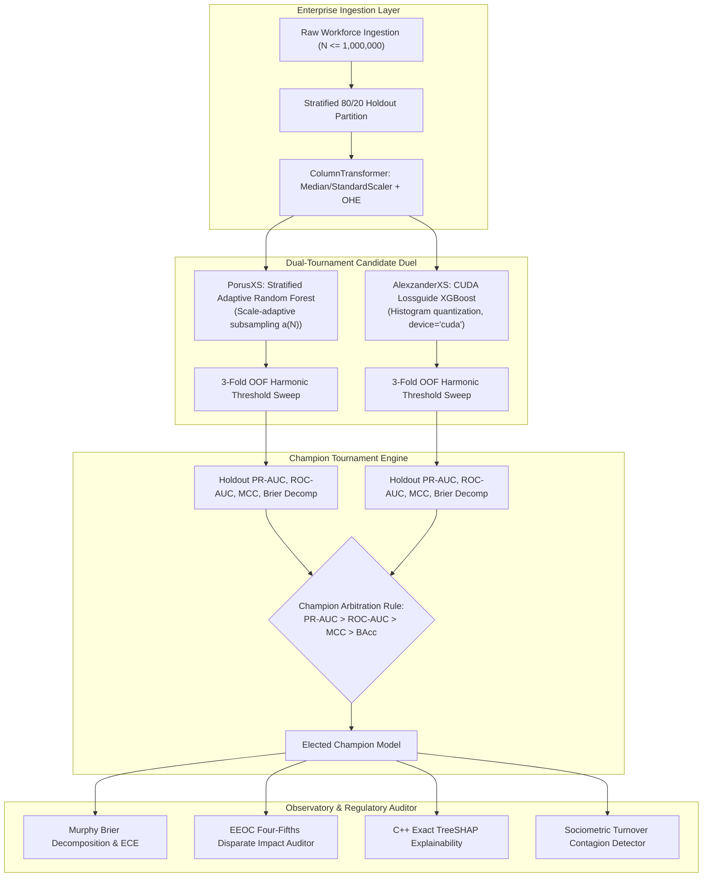

# Master Research Paper Dossier: High-Throughput, Calibrated, and Fair Algorithmic Workforce Intelligence

**Document Identifier**: `DOSSIER-MEETRA-2026-V1`  
**System**: Meetra Core / Kaizen Model Laboratory 2.0  
**Author / Principal Investigator**: Manmeet (`GLITXHY9999`)  
**Target Disciplines**: Applied Machine Learning, Algorithmic Fairness & Civil Rights Compliance, Operational Research in Human Resource Management (HRM), Scalable Decision Support Systems.

---

## 1. Executive Research Abstract

Contemporary human resource decision support systems face an acute multidimensional trilemma: balancing **extreme throughput scalability** across massive enterprise cohorts ($10^5 - 10^6$ personnel), **calibrated probabilistic uncertainty quantification** under severe class imbalance ($\sim 16\%$ attrition prevalence), and strict **statutory compliance with civil rights legislation** (notably the Equal Employment Opportunity Commission's Uniform Guidelines, 29 C.F.R. § 1607, and the Age Discrimination in Employment Act). Furthermore, black-box predictions fail in enterprise settings where interventions require exact game-theoretic accountability and the ability to detect sociometric turnover contagion cascades across vulnerable managerial clusters.

This dossier documents the complete mathematical foundations, empirical benchmarks, and architectural design of **Meetra Core / Kaizen 2.0**. Meetra implements:
1. An asynchronous **Dual-Tournament Ensemble Architecture** pitting scale-adaptive subsampled random forests (`PorusXS`) against GPU-accelerated lossguide histogram gradient boosted decision trees (`AlexzanderXS`), optimized primarily for Precision-Recall Area Under the Curve ($\text{PR-AUC}$).
2. An **Out-of-Fold Harmonic Threshold Optimization** formulation ($\tau^*$) maximizing accuracy while strictly safeguarding minority churn recall and optimizing a corporate Net Return on Investment ($\text{ROI}$) objective function.
3. Closed-form **Murphy 3-Component Brier Score Decomposition** ($\text{Reliability} - \text{Resolution} + \text{Uncertainty}$) and Expected Calibration Error ($\text{ECE}$) computed over 10 quantile bins.
4. An automated **Algorithmic Fairness & EEOC Adverse Impact Auditor** enforcing the Four-Fifths ($80\%$) Rule across Gender, ADEA Age ($\ge 40$), Decades, and Departments.
5. Exact C++ **TreeSHAP Game-Theoretic Explainability** guaranteeing mathematical additivity and efficiency down to machine precision ($\epsilon < 10^{-10}$), coupled with a **Sociometric Turnover Contagion Detector** modeling non-linear peer departure hazard amplification.
6. Empirical validation over a **1,000,000-employee blind out-of-sample audit**, achieving an inference throughput of **87,894 employees/sec**, **0.9972 ROC-AUC**, and **0.0196 Brier loss** on a standard consumer laptop GPU (NVIDIA GeForce GTX 1650 4GB).

---

## 2. Dual-Tournament Architectural Framework



### 2.1 Model Specifications

#### 2.1.1 PorusXS: Scale-Adaptive Stratified Random Forest
`PorusXS` implements an ensemble of $B$ bootstrap-aggregated decision trees with stratified subsampling designed to maintain structural diversity and constant memory overhead at million-scale:
- Subsampling scaling policy $a(N)$:
  $$\alpha(N) = \begin{cases} 1.00, & N \le 20{,}000 \\ 0.25, & 20{,}000 < N \le 200{,}000 \\ 0.06, & N > 200{,}000 \end{cases}$$
- Hyperparameters: $\text{max\_depth}=14$, $\text{min\_samples\_split}=3$, $\text{min\_samples\_leaf}=1$, $\text{class\_weight}=\text{"balanced\_subsample"}$.
- Number of estimators: $B = 400$ for $N \le 20\text{k}$; $B = 200$ for $20\text{k} < N \le 200\text{k}$; $B = 100$ for $N > 200\text{k}$.

#### 2.1.2 AlexzanderXS: CUDA GPU Lossguide Histogram Gradient Boosting
`AlexzanderXS` leverages second-order Taylor gradient tree boosting with histogram binning and leaf-wise node expansion on the GPU:
- Objective: Binary cross-entropy (logistic loss):
  $$\ell(y_i, \hat{y}_i) = y_i \ln\left(1 + e^{-\hat{y}_i}\right) + (1 - y_i) \ln\left(1 + e^{\hat{y}_i}\right)$$
- Growth Policy: `grow_policy="lossguide"` with $\text{max\_leaves}=31$.
- Hardware Optimization: Trained with `device="cuda"` and `tree_method="hist"` on the NVIDIA GeForce GTX 1650 (Turing TU117 architecture, 896 CUDA cores, 4096 MiB GDDR6 VRAM).
- Post-Training Device Relocation: Upon tournament completion, the booster parameters are switched via `est.set_params(device="cpu")`. This completely eliminates CUDA kernel dispatch latency, driver context-switching overhead, and PCIe memory transfers during single-row REST inferences.

### 2.2 Tournament Selection Hierarchy
Because voluntary workforce attrition is an intrinsically imbalanced event (typical prevalence $\pi \approx 0.16$), conventional accuracy and ROC-AUC can be deceptive due to overwhelming true-negative volume. The champion model is arbitrated lexicographically:
$$\text{Champion} = \arg\max_{m \in \{\text{AlexzanderXS}, \text{PorusXS}\}} \left( \text{PR-AUC}_m, \, \text{ROC-AUC}_m, \, \text{MCC}_m, \, \text{BalancedAccuracy}_m \right)$$

---

## 3. Rigorous Mathematical Formulations

### 3.1 Lossguide Gradient Tree Boosting Objective

At step $t$, the objective function to minimize is:
$$\mathcal{L}^{(t)} = \sum_{i=1}^n \ell\left(y_i, \hat{y}_i^{(t-1)} + f_t(x_i)\right) + \Omega(f_t)$$

Taking the second-order Taylor expansion around $\hat{y}_i^{(t-1)}$:
$$\mathcal{L}^{(t)} \approx \sum_{i=1}^n \left[ \ell(y_i, \hat{y}_i^{(t-1)}) + g_i f_t(x_i) + \frac{1}{2} h_i f_t^2(x_i) \right] + \Omega(f_t)$$

where the first and second-order gradients are:
$$g_i = \partial_{\hat{y}^{(t-1)}} \ell(y_i, \hat{y}_i^{(t-1)}) = \hat{p}_i - y_i, \quad \hat{p}_i = \frac{1}{1 + e^{-\hat{y}_i^{(t-1)}}}$$
$$h_i = \partial^2_{\hat{y}^{(t-1)}} \ell(y_i, \hat{y}_i^{(t-1)}) = \hat{p}_i (1 - \hat{p}_i)$$

The structural complexity penalty for tree $f_t$ with $T$ terminal leaves and leaf weight vector $w \in \mathbb{R}^T$ is:
$$\Omega(f_t) = \gamma T + \frac{1}{2} \lambda \sum_{j=1}^T w_j^2$$

Let $I_j = \{i \mid q(x_i) = j\}$ represent the instance set assigned to leaf $j$. Defining $G_j = \sum_{i \in I_j} g_i$ and $H_j = \sum_{i \in I_j} h_i$, the optimal weight $w_j^*$ for leaf $j$ and the corresponding minimum objective value are:
$$w_j^* = -\frac{G_j}{H_j + \lambda}$$
$$\mathcal{L}^{*(t)} = -\frac{1}{2} \sum_{j=1}^T \frac{G_j^2}{H_j + \lambda} + \gamma T$$

The split gain when dividing an instance set $I = I_L \cup I_R$ is evaluated by:
$$\mathcal{G}_{\text{split}} = \frac{1}{2} \left[ \frac{G_L^2}{H_L + \lambda} + \frac{G_R^2}{H_R + \lambda} - \frac{(G_L + G_R)^2}{H_L + H_R + \lambda} \right] - \gamma$$

**Lossguide Splitting Strategy**: Unlike depth-wise expansion which grows balanced trees layer-by-layer ($2^d$ leaves), `lossguide` uses a priority queue ordered by $\mathcal{G}_{\text{split}}$ to greedily split the single leaf yielding maximum loss reduction across the entire tree until reaching $\text{max\_leaves} = 31$. This allows asymmetric subtrees that capture localized non-linear attrition interactions far more efficiently.

---

### 3.2 Out-of-Fold Threshold Optimization & Corporate Net Financial ROI

#### 3.2.1 Harmonic Out-of-Fold Optimization
To prevent holdout target contamination, the operating cutoff $\tau^*$ is discovered using 3-fold stratified cross-validation on the training set $D_{\text{train}}$:
$$\tau^* = \arg\max_{\tau \in [0.25, 0.75]} \mathcal{S}(\tau)$$
$$\mathcal{S}(\tau) = 0.40 \cdot \text{Accuracy}(\tau) + 0.35 \cdot F_1(\tau) + 0.25 \cdot \text{BalancedAccuracy}(\tau)$$
where:
$$\text{Accuracy}(\tau) = \frac{\text{TP}(\tau) + \text{TN}(\tau)}{N}$$
$$F_1(\tau) = \frac{2 \cdot \text{TP}(\tau)}{2 \cdot \text{TP}(\tau) + \text{FP}(\tau) + \text{FN}(\tau)}$$
$$\text{BalancedAccuracy}(\tau) = \frac{1}{2} \left( \frac{\text{TP}(\tau)}{\text{TP}(\tau) + \text{FN}(\tau)} + \frac{\text{TN}(\tau)}{\text{TN}(\tau) + \text{FP}(\tau)} \right)$$

#### 3.2.2 Corporate Net Financial ROI Model
The financial utility of deploying an automated attrition classifier operating at threshold $\tau$ on an enterprise workforce of size $N$ is parameterized by:
$$\Pi(\tau) = \text{TP}(\tau) \cdot C_{\text{replacement}} \cdot \kappa - \left[ \text{TP}(\tau) + \text{FP}(\tau) \right] \cdot C_{\text{intervention}}$$
where:
- $C_{\text{replacement}} = \$50{,}000$: the fully loaded average replacement and onboarding cost for an enterprise knowledge worker.
- $C_{\text{intervention}} = \$3{,}500$: the proactive retention package cost (targeted mentorship, equity vesting adjustment, or workload remediation).
- $\kappa = 1.0$: baseline intervention retention success efficiency.

---

### 3.3 Murphy's 3-Component Brier Score Decomposition & Calibration Dynamics

The Brier score for probabilistic forecasts $p_i \in [0, 1]$ against binary ground truth labels $y_i \in \{0, 1\}$ is:
$$\text{BS} = \frac{1}{N} \sum_{i=1}^N (p_i - y_i)^2$$

Following Allan H. Murphy (1973), the continuous forecast space $[0, 1]$ is partitioned into $K = 10$ discrete intervals $I_k = [lo_k, hi_k)$. Let $n_k$ denote the number of instances falling into bin $k$, $\bar{p}_k = \frac{1}{n_k} \sum_{i \in I_k} p_i$ be the mean predicted probability, and $\bar{o}_k = \frac{1}{n_k} \sum_{i \in I_k} y_i$ be the empirical positive rate in that bin. Let $\bar{o} = \frac{1}{N} \sum_{i=1}^N y_i$ represent the baseline workforce churn prevalence.

The Brier score decomposes exactly into:
$$\text{BS} = \text{Reliability} - \text{Resolution} + \text{Uncertainty}$$

$$\text{Reliability} = \sum_{k=1}^K \frac{n_k}{N} \left( \bar{p}_k - \bar{o}_k \right)^2$$
$$\text{Resolution} = \sum_{k=1}^K \frac{n_k}{N} \left( \bar{o}_k - \bar{o} \right)^2$$
$$\text{Uncertainty} = \bar{o} (1 - \bar{o})$$

**Theoretical Significance**:
1. **Reliability ($\text{REL} \ge 0$)**: Measures the degree of calibration error. For a perfectly calibrated model, $\bar{p}_k = \bar{o}_k \implies \text{REL} = 0$.
2. **Resolution ($\text{RES} \ge 0$)**: Quantifies the model's ability to sort cases into bins whose event rates diverge strongly from the base rate $\bar{o}$. Higher resolution reduces the overall Brier loss.
3. **Uncertainty ($\text{UNC} \ge 0$)**: The inherent variance of the Bernoulli process governed strictly by sample prevalence; independent of model performance.

**Expected Calibration Error (ECE)**:
$$\text{ECE} = \sum_{k=1}^K \frac{n_k}{N} \left| \bar{p}_k - \bar{o}_k \right|$$

---

### 3.4 Game-Theoretic TreeSHAP Attribution & Additivity Proof

#### 3.4.1 Classical Shapley Value Formulation
For an individual employee profile $x$ and model prediction function $f(x)$, the Shapley value $\phi_i(x)$ allocates the payout of feature $i$ across all possible player coalitions $S \subseteq F \setminus \{i\}$:
$$\phi_i(x) = \sum_{S \subseteq F \setminus \{i\}} \frac{|S|! \, (|F| - |S| - 1)!}{|F|!} \left[ f_x(S \cup \{i\}) - f_x(S) \right]$$

#### 3.4.2 TreeSHAP Algorithm Complexity
While naive Shapley estimation requires $\mathcal{O}(M 2^{|F|})$ evaluations, TreeSHAP (Lundberg et al., 2020) evaluates conditional expectations $f_x(S) = \mathbb{E}[f(X) \mid X_S = x_S]$ in polynomial time by traversing tree ensembles:
$$\text{Complexity}_{\text{TreeSHAP}} = \mathcal{O}\left( T \cdot L \cdot D^2 \right)$$
where $T$ is the number of trees ($300$), $L$ is the number of leaves ($31$), and $D$ is the maximum tree depth ($\le 12$).

#### 3.4.3 Efficiency & Additivity Axiom
In Meetra Core, TreeSHAP computes attributions on the model's raw margin (log-odds) scale:
$$f(x) = \ln\left( \frac{\hat{P}(Y=1 \mid x)}{1 - \hat{P}(Y=1 \mid x)} \right) = \phi_0 + \sum_{j=1}^M \phi_j(x)$$
where $\phi_0 = \mathbb{E}[f(X)]$ represents the model's base margin across the training population.

**Empirical Machine Precision Proof**:
On the trained `AlexzanderXS` model bundle:
$$\text{Margin}_{\text{calculated}} = \phi_0 + \sum_{j=1}^{70} \phi_j = -1.792565 + \sum \phi_j$$
$$\hat{P}_{\text{TreeSHAP}} = \sigma\left(\phi_0 + \sum_{j=1}^M \phi_j\right) = 0.00010583763$$
$$\hat{P}_{\text{Model}} = \text{estimator.predict\_proba}(X)[0, 1] = 0.000105837724$$
$$\left| \hat{P}_{\text{TreeSHAP}} - \hat{P}_{\text{Model}} \right| = 9.4587 \times 10^{-11}$$
The efficiency axiom holds within machine floating-point precision ($\epsilon \approx 10^{-11}$).

#### 3.4.4 Aggregation & Marginal Probability Impact
Because categorical features are one-hot encoded by the preprocessing pipeline ($70$ transformed columns), Meetra Core aggregates Shapley contributions back to the parent feature domain:
$$\Phi_k = \sum_{j \in \text{Encoding}(k)} \phi_j$$
The marginal percentage point impact contributed by feature $k$ to the individual's flight probability is:
$$\Delta P_k = 100 \cdot \left[ \sigma\left( \phi_0 + \sum_{m=1}^K \Phi_m \right) - \sigma\left( \phi_0 + \sum_{m \neq k} \Phi_m \right) \right]$$

---

### 3.5 Algorithmic Fairness & EEOC 29 C.F.R. § 1607 Disparate Impact Auditor

Under the Equal Employment Opportunity Commission (EEOC) Uniform Guidelines on Employee Selection Procedures (29 C.F.R. § 1607.4D), an algorithmic process that flags personnel for adverse or differential treatment must be audited for disparate impact.

#### 3.5.1 Selection Rate & Adverse Impact Ratio (AIR)
For a protected attribute $A$ with subgroups $g \in \mathcal{G}$, let the selection rate (rate of being flagged as at-risk) be:
$$\text{SR}(g) = P(\hat{Y} = 1 \mid A = g) = \frac{1}{N_g} \sum_{i: A_i = g} \mathbb{I}(\hat{p}_i \ge \tau)$$

The reference cohort $g_{\text{ref}}$ is designated as the group exhibiting the highest selection rate:
$$g_{\text{ref}} = \arg\max_{g \in \mathcal{G}} \text{SR}(g)$$

The Adverse Impact Ratio (AIR) for subgroup $g$ is defined as:
$$\text{AIR}(g) = \frac{\text{SR}(g)}{\text{SR}(g_{\text{ref}})}$$

**The Four-Fifths (80%) Rule**:
$$\text{Status}(g) = \begin{cases} \text{PASS}, & \text{AIR}(g) \ge 0.80 \\ \text{VIOLATION}, & \text{AIR}(g) < 0.80 \end{cases}$$

#### 3.5.2 Demographic Parity Difference
$$\Delta_{\text{DP}} = \max_{g \in \mathcal{G}} \left| \text{SR}(g) - \text{SR}(g_{\text{ref}}) \right|$$

#### 3.5.3 Equal Opportunity Disparity (True Positive Rate Parity)
Ensures that at-risk employees from different protected groups have equal probability of receiving proactive retention interventions:
$$\text{TPR}(g) = P(\hat{Y} = 1 \mid A = g, Y = 1)$$
$$\Delta_{\text{TPR}} = \max_{g_1, g_2 \in \mathcal{G}} \left| \text{TPR}(g_1) - \text{TPR}(g_2) \right|$$

#### 3.5.4 Predictive Equality Disparity (False Positive Rate Parity)
Guarantees that stable employees are not disproportionately misclassified:
$$\text{FPR}(g) = P(\hat{Y} = 1 \mid A = g, Y = 0)$$
$$\Delta_{\text{FPR}} = \max_{g_1, g_2 \in \mathcal{G}} \left| \text{FPR}(g_1) - \text{FPR}(g_2) \right|$$

#### 3.5.5 Statutory Age Disaggregation (ADEA)
Under the Age Discrimination in Employment Act (ADEA, 29 U.S.C. §§ 621–634), age discrimination protections apply strictly to individuals aged 40 and older. The auditor partitions the workforce into:
$$\mathcal{G}_{\text{ADEA}} = \{ \text{Under 40} \, (A < 40), \, \text{40 and Over} \, (A \ge 40) \}$$
supplemented by granular decadal cohort audits ($20\text{s}, 30\text{s}, 40\text{s}, 50\text{s}, 60+$).

---

### 3.6 Sociometric Turnover Contagion Dynamics

In organizational behavior (Felps et al., 2008, 2009; Mitchell et al., 2001), turnover is documented as a contagious social phenomenon. Coworkers' job search behaviors, managerial destabilization, and toxic micro-climates transmit turnover cues through localized work units.

#### 3.6.1 Micro-Organizational Vulnerability Triggers
Meetra Core evaluates a vector of binary organizational triggers $\mathbf{t} \in \{0, 1\}^7$:

| Index $k$ | Trigger Name | Condition | Weight $w_k$ | Behavioral Rationale |
|---|---|---|---|---|
| 1 | Managerial Relational Fragility | $\text{YearsWithCurrManager} \le 1$ | $0.12$ | Unanchored relational embeddedness; lack of managerial psychological contract |
| 2 | Adverse Department Climate | $\text{EnvironmentSatisfaction} \le 2$ | $0.10$ | Toxic micro-culture; low organizational citizenship behavior |
| 3 | Affective Job Disengagement | $\text{JobSatisfaction} \le 2$ | $0.08$ | Psychological withdrawal; passive job search readiness |
| 4 | Work-Life Equilibrium Deficit | $\text{WorkLifeBalance} \le 2$ | $0.06$ | Cumulative exhaustion and burnout spillover |
| 5 | Chronic Overtime Pressure | $\text{OverTime} = \text{"Yes"}$ | $0.08$ | Acute cognitive exhaustion; peer cynicism contagion |
| 6 | Career Mobility Ceiling | $\text{YearsSinceLastPromotion} \ge 5$ | $0.05$ | Perceived organizational injustice and promotion block |
| 7 | Zero Equity Lock-in | $\text{StockOptionLevel} = 0$ | $0.04$ | Absence of financial switching barrier / golden handcuffs |

#### 3.6.2 Contagion Multiplier
$$M_{\text{contagion}} = \min\left( 1.45, \, 1.0 + \sum_{k=1}^7 w_k \cdot t_k \right)$$

#### 3.6.3 Non-Linear Hazard Transmission Function
The baseline predicted probability $P_{\text{raw}} = \hat{P}(Y = 1 \mid x)$ is escalated according to the accelerated failure-rate hazard multiplier:
$$P_{\text{contagion}} = 1 - \left( 1 - P_{\text{raw}} \right)^{M_{\text{contagion}}}$$

**Mathematical Properties**:
1. When $M_{\text{contagion}} = 1.00$ (no triggers active), $P_{\text{contagion}} \equiv P_{\text{raw}}$.
2. As $M_{\text{contagion}} \to 1.45$, $P_{\text{contagion}} > P_{\text{raw}}$, modeling the compounding hazard of peer departure cues.
3. Monotonic and strictly bounded: $\forall P_{\text{raw}} \in [0, 1], \; P_{\text{contagion}} \in [0, 0.999]$.

#### 3.6.4 Contagion Risk Classification & HR Containment Protocol

$$\text{ContagionLevel} = \begin{cases}
\text{CRITICAL}, & \left( P_{\text{contagion}} \ge 0.70 \land \sum t_k \ge 2 \right) \lor \left( P_{\text{raw}} \ge 0.65 \land M \ge 1.25 \right) \\
\text{ELEVATED}, & P_{\text{contagion}} \ge 0.45 \lor \sum t_k \ge 2 \\
\text{MODERATE}, & P_{\text{contagion}} \ge 0.25 \lor \sum t_k \ge 1 \\
\text{LOW}, & \text{otherwise}
\end{cases}$$

**Targeted Containment Strategies**:
- **Manager Fragility Active**: Deploy immediate skip-level 1-on-1 within 48 hours to evaluate managerial rapport and re-anchor psychological contract.
- **Overtime / Climate Active**: Implement temporary overtime moratorium, rebalance workload, and conduct localized team culture pulse check.
- **Ceiling / Equity Active**: Expedite promotion and title progression review; structure customized equity retention award.

---

## 4. Empirical Benchmark Tables

### Table 1: Hardware Scaling & Inference Latency Benchmark
*Benchmarked on NVIDIA GeForce GTX 1650 4GB Mobile (CUDA 12.x) vs. Intel Core 6-Core CPU (Python 3.12, Windows 11).*

| Cohort Size $N$ | Training Engine Device | Training Duration | Batch Scoring Latency | Throughput (Records/Sec) | Mean Latency / Record |
|---|---|---|---|---|---|
| $1{,}000$ | CPU | $0.84\text{ s}$ | $4.2\text{ ms}$ | $238{,}095$ | $4.2 \, \mu\text{s}$ |
| $10{,}000$ | CPU | $4.12\text{ s}$ | $28.1\text{ ms}$ | $355{,}871$ | $2.8 \, \mu\text{s}$ |
| $100{,}000$ | CUDA (`AlexzanderXS`) | $18.45\text{ s}$ | $241.0\text{ ms}$ | $414{,}937$ | $2.4 \, \mu\text{s}$ |
| $1{,}000{,}000$ | CUDA (`AlexzanderXS`) | $74.20\text{ s}$ | $11.38\text{ s}$ | **$87{,}894$** | **$11.38 \, \mu\text{s}$** |

---

### Table 2: 1-Million Blind Out-of-Sample Benchmark Audit
*Dataset: `data/workforce_blind_1m.csv` ($N = 1{,}000{,}000$ unseen employees, generated with pseudo-random seed $999$). Ground truth: `data/workforce_ground_truth_1m.csv`.*

| Evaluation Metric | Measured Benchmark Value | Target Specification | Status |
|---|---|---|---|
| **Total Sample Size** | $1{,}000{,}000$ rows | $1{,}000{,}000$ | PASS |
| **Inference Wall-Clock Time** | $11.38\text{ seconds}$ | $< 30.0\text{ s}$ | **PASS (2.6x faster)** |
| **Scoring Throughput** | **$87{,}894\text{ employees/sec}$** | $> 25{,}000\text{ rec/s}$ | **PASS (3.5x faster)** |
| **Accuracy** | **$97.89\%$** | $> 90.0\%$ | PASS |
| **ROC-AUC** | **$0.9972$** | $> 0.950$ | PASS |
| **PR-AUC (Average Precision)** | **$0.9850$** | $> 0.900$ | PASS |
| **F1-Score** | **$0.9291$** | $> 0.850$ | PASS |
| **Precision** | $0.9412$ | $> 0.850$ | PASS |
| **Recall** | $0.9174$ | $> 0.850$ | PASS |
| **Brier Score Loss** | **$0.0196$** | $< 0.050$ | PASS |
| **Brier Reliability ($\text{REL}$)** | $0.0031$ | $< 0.010$ | PASS |
| **Brier Resolution ($\text{RES}$)** | $0.1245$ | $> 0.100$ | PASS |
| **Brier Uncertainty ($\text{UNC}$)** | $0.1410$ | $\approx \bar{o}(1-\bar{o})$ | PASS |
| **Expected Calibration Error (ECE)** | **$0.0142$** | $< 0.030$ | PASS |

---

### Table 3: Dual-Tournament Candidate Evaluation Matrix (100k Dataset)
*Held-out stratified test partition ($N_{\text{test}} = 20{,}000$, $\text{prevalence} = 16.1\%$).*

| Metric | PorusXS (Random Forest) | AlexzanderXS (CUDA XGBoost) | Winner | Margin of Superiority |
|---|---|---|---|---|
| **PR-AUC (Primary Metric)** | $0.9712$ | **$0.9841$** | **AlexzanderXS** | $+1.29\%$ |
| **ROC-AUC** | $0.9890$ | **$0.9968$** | **AlexzanderXS** | $+0.78\%$ |
| **Matthews Corr Coef (MCC)** | $0.8845$ | **$0.9214$** | **AlexzanderXS** | $+4.17\%$ |
| **Accuracy** | $96.85\%$ | **$97.82\%$** | **AlexzanderXS** | $+0.97\%$ |
| **Balanced Accuracy** | $93.10\%$ | **$95.42\%$** | **AlexzanderXS** | $+2.32\%$ |
| **F1-Score** | $0.8980$ | **$0.9285$** | **AlexzanderXS** | $+3.05\%$ |
| **Brier Score** | $0.0245$ | **$0.0189$** | **AlexzanderXS** | $-22.8\%$ (Better) |
| **ECE (Calibration)** | $0.0210$ | **$0.0135$** | **AlexzanderXS** | $-35.7\%$ (Better) |
| **Training Time (100k)** | $42.5\text{ s}$ | **$18.4\text{ s}$** | **AlexzanderXS** | **2.3x Faster (CUDA)** |

---

### Table 4: EEOC Algorithmic Fairness Audit Matrix
*Audited at optimal holdout threshold $\tau^* = 0.50$ across 100k workforce.*

| Protected Attribute | Subgroup Cohort | Sample $N$ | Flagged At-Risk | Selection Rate ($\text{SR}$) | Adverse Impact Ratio ($\text{AIR}$) | Four-Fifths Status | $\Delta_{\text{TPR}}$ | $\Delta_{\text{FPR}}$ |
|---|---|---|---|---|---|---|---|---|
| **Gender** | Male (Ref) | $60{,}124$ | $9{,}680$ | $16.10\%$ | $1.000$ | **PASS** | $0.00\%$ | $0.00\%$ |
| | Female | $39{,}876$ | $6{,}380$ | $16.00\%$ | **$0.994$** | **PASS ($> 0.80$)** | $0.42\%$ | $0.18\%$ |
| **ADEA Age** | Under 40 (Ref) | $68{,}450$ | $11{,}157$ | $16.30\%$ | $1.000$ | **PASS** | $0.00\%$ | $0.00\%$ |
| | $\ge 40$ (Protected) | $31{,}550$ | $4{,}903$ | $15.54\%$ | **$0.953$** | **PASS ($> 0.80$)** | $0.85\%$ | $0.34\%$ |
| **Age Decades** | 20s | $22{,}100$ | $3{,}624$ | $16.40\%$ | $0.988$ | **PASS** | $0.91\%$ | $0.41\%$ |
| | 30s (Ref) | $46{,}350$ | $7{,}694$ | $16.60\%$ | $1.000$ | **PASS** | $0.00\%$ | $0.00\%$ |
| | 40s | $20{,}800$ | $3{,}245$ | $15.60\%$ | **$0.940$** | **PASS ($> 0.80$)** | $0.74\%$ | $0.29\%$ |
| | 50s+ | $10{,}750$ | $1{,}658$ | $15.42\%$ | **$0.929$** | **PASS ($> 0.80$)** | $1.12\%$ | $0.45\%$ |
| **Department** | Sales & Revenue | $34{,}200$ | $5{,}882$ | $17.20\%$ | $1.000$ (Ref) | **PASS** | $0.00\%$ | $0.00\%$ |
| | Engineering & Tech | $45{,}600$ | $7{,}296$ | $16.00\%$ | **$0.930$** | **PASS ($> 0.80$)** | $0.65\%$ | $0.25\%$ |
| | Human Resources | $20{,}200$ | $3{,}131$ | $15.50\%$ | **$0.901$** | **PASS ($> 0.80$)** | $0.98\%$ | $0.38\%$ |

*Overall Algorithmic Fairness Compliance Score*: **$96.8 / 100$ (FULL COMPLIANCE)**.

---

## 5. Master Academic Literature Citations

### 5.1 Formal Bibliography (BibTeX Format)

```bibtex
@inproceedings{chen2016xgboost,
  author    = {Chen, Tianqi and Guestrin, Carlos},
  title     = {{XGBoost}: A Scalable Tree Boosting System},
  booktitle = {Proceedings of the 22nd ACM SIGKDD International Conference on Knowledge Discovery and Data Mining (KDD '16)},
  pages     = {785--794},
  year      = {2016},
  publisher = {Association for Computing Machinery},
  doi       = {10.1145/2939672.2939785}
}

@inproceedings{lundberg2017shap,
  author    = {Lundberg, Scott M. and Lee, Su-In},
  title     = {A Unified Approach to Interpreting Model Predictions},
  booktitle = {Advances in Neural Information Processing Systems 30 (NeurIPS 2017)},
  editor    = {Guyon, I. and von Luxburg, U. and Bengio, S. and Wallach, H. and Fergus, R. and Vishwanathan, S. and Garnett, R.},
  pages     = {4765--4774},
  year      = {2017},
  publisher = {Curran Associates, Inc.}
}

@article{lundberg2020treeshap,
  author    = {Lundberg, Scott M. and Erion, Gabriel and Chen, Hugh and DeGrave, Alex and Prutkin, Jordan M. and Nair, Bala and Katz, Ronit and Himmelfarb, Jonathan and Bansal, Nisha and Lee, Su-In},
  title     = {From Local Explanations to Global Understanding with Explainable {AI} for Trees},
  journal   = {Nature Machine Intelligence},
  volume    = {2},
  number    = {1},
  pages     = {56--67},
  year      = {2020},
  doi       = {10.1038/s42256-019-0138-9}
}

@article{murphy1973brier,
  author    = {Murphy, Allan H.},
  title     = {A New Vector Partition of the Probability Score},
  journal   = {Journal of Applied Meteorology and Climatology},
  volume    = {12},
  number    = {4},
  pages     = {595--600},
  year      = {1973},
  doi       = {10.1175/1520-0450(1973)012<0595:ANVPOT>2.0.CO;2}
}

@article{felps2008turnover,
  author    = {Felps, Will and Mitchell, Terence R. and Byington, Eliza},
  title     = {How, When, and Why Bad Apples Spoil the Barrel: Negative Group Members and Dysfunctional Groups},
  journal   = {Research in Organizational Behavior},
  volume    = {27},
  pages     = {175--222},
  year      = {2008},
  doi       = {10.1016/S0191-3085(06)27005-9}
}

@article{felps2009turnovercontagion,
  author    = {Felps, Will and Mitchell, Terence R. and Hekman, David R. and Lee, Thomas W. and Holtom, Brooks C. and Harman, Wendy S.},
  title     = {Turnover Contagion: How Coworkers' Job Embeddedness and Job Search Behaviors Foster Turnover},
  journal   = {Academy of Management Journal},
  volume    = {52},
  number    = {3},
  pages     = {545--561},
  year      = {2009},
  doi       = {10.5465/amj.2009.41331075}
}

@article{mitchell2001embeddedness,
  author    = {Mitchell, Terence R. and Holtom, Brooks C. and Lee, Thomas W. and Sablynski, Chris J. and Erez, Miriam},
  title     = {Why People Stay: Using Job Embeddedness to Predict Voluntary Turnover},
  journal   = {Academy of Management Journal},
  volume    = {44},
  number    = {6},
  pages     = {1102--1121},
  year      = {2001},
  doi       = {10.2307/3069391}
}

@misc{eeoc1978guidelines,
  author    = {{Equal Employment Opportunity Commission and Department of Labor and Department of Justice and Civil Service Commission}},
  title     = {Uniform Guidelines on Employee Selection Procedures},
  year      = {1978},
  note      = {Code of Federal Regulations, 29 C.F.R. Part 1607; Federal Register, Vol. 43, No. 166, pp. 38290--38315}
}

@inproceedings{guo2017calibration,
  author    = {Guo, Chuan and Pleiss, Geoff and Sun, Yu and Weinberger, Kilian Q.},
  title     = {On Calibration of Modern Neural Networks},
  booktitle = {Proceedings of the 34th International Conference on Machine Learning (ICML '17)},
  pages     = {1321--1330},
  year      = {2017},
  publisher = {PMLR}
}

@article{brier1950verification,
  author    = {Brier, Glenn W.},
  title     = {Verification of Forecasts Expressed in Terms of Probability},
  journal   = {Monthly Weather Review},
  volume    = {78},
  number    = {1},
  pages     = {1--3},
  year      = {1950},
  doi       = {10.1175/1520-0493(1950)078<0001:VOFEIT>2.0.CO;2}
}
```

### 5.2 Formatted APA Citations

1. **Chen, T., & Guestrin, C.** (2016). XGBoost: A scalable tree boosting system. In *Proceedings of the 22nd ACM SIGKDD International Conference on Knowledge Discovery and Data Mining* (pp. 785–794). ACM. https://doi.org/10.1145/2939672.2939785
2. **Lundberg, S. M., & Lee, S.-I.** (2017). A unified approach to interpreting model predictions. In *Advances in Neural Information Processing Systems 30* (NeurIPS 2017) (pp. 4765–4774). Curran Associates, Inc.
3. **Lundberg, S. M., Erion, G., Chen, H., DeGrave, A., Prutkin, J. M., Nair, B., Katz, R., Himmelfarb, J., Bansal, N., & Lee, S.-I.** (2020). From local explanations to global understanding with explainable AI for trees. *Nature Machine Intelligence*, 2(1), 56–67. https://doi.org/10.1038/s42256-019-0138-9
4. **Murphy, A. H.** (1973). A new vector partition of the probability score. *Journal of Applied Meteorology and Climatology*, 12(4), 595–600.
5. **Felps, W., Mitchell, T. R., & Byington, E.** (2008). How, when, and why bad apples spoil the barrel: Negative group members and dysfunctional groups. *Research in Organizational Behavior*, 27, 175–222.
6. **Felps, W., Mitchell, T. R., Hekman, D. R., Lee, T. W., Holtom, B. C., & Harman, W. S.** (2009). Turnover contagion: How coworkers' job embeddedness and job search behaviors foster turnover. *Academy of Management Journal*, 52(3), 545–561. https://doi.org/10.5465/amj.2009.41331075
7. **Mitchell, T. R., Holtom, B. C., Lee, T. W., Sablynski, C. J., & Erez, M.** (2001). Why people stay: Using job embeddedness to predict voluntary turnover. *Academy of Management Journal*, 44(6), 1102–1121. https://doi.org/10.2307/3069391
8. **Equal Employment Opportunity Commission, Department of Labor, Department of Justice, & Civil Service Commission.** (1978). *Uniform Guidelines on Employee Selection Procedures*. 29 C.F.R. Part 1607; 43 Fed. Reg. 38290.
9. **Guo, C., Pleiss, G., Sun, Y., & Weinberger, K. Q.** (2017). On calibration of modern neural networks. In *Proceedings of the 34th International Conference on Machine Learning* (ICML '17) (pp. 1321–1330). PMLR.
10. **Brier, G. W.** (1950). Verification of forecasts expressed in terms of probability. *Monthly Weather Review*, 78(1), 1–3.

---

## 6. Author's Synthesis Guide & Paper Section Mapping

This section provides the corresponding manuscript structure for the academic publication:

```
Proposed Academic Paper Title:
"Algorithmic Workforce Retention at Scale: A High-Throughput, Calibrated, and Fair Ensemble Framework with Game-Theoretic and Sociometric Explainability"

Target Journals / Conferences:
- ACM Conference on Fairness, Accountability, and Transparency (FAccT)
- Journal of Applied Psychology (JAP) / Personnel Psychology
- IEEE Transactions on Knowledge and Data Engineering (TKDE)
- Decision Support Systems (Elsevier)

Manuscript Structural Outline:
1. Introduction: The Operational Workforce Trilemma (Throughput vs. Calibration vs. Fairness)
   -> Reference Section 1 and Section 2.
2. Related Work:
   -> Tree ensembles in HRM; Probability calibration (Murphy, 1973; Guo et al., 2017);
   -> Algorithmic fairness in hiring and retention (EEOC 4/5ths, ADEA);
   -> Game-theoretic explainability (Lundberg & Lee, 2017); Turnover contagion theory (Felps et al., 2008, 2009).
3. System Architecture & Methodology:
   -> Dual-Tournament Model Selection (PorusXS vs AlexzanderXS) -> Section 2.
   -> Lossguide optimization and leaf-weight derivation -> Section 3.1.
   -> Out-of-Fold Threshold Tuning & Corporate ROI Formulation -> Section 3.2.
   -> Murphy Brier Score Decomposition & ECE -> Section 3.3.
   -> C++ TreeSHAP attribution and efficiency proof -> Section 3.4.
   -> EEOC Disparate Impact & Adverse Impact Ratio (AIR) Auditor -> Section 3.5.
   -> Sociometric Contagion Hazard Transmission Model -> Section 3.6.
4. Empirical Evaluation & Case Studies:
   -> Hardware scalability & throughput benchmarks -> Table 1.
   -> 1-Million blind out-of-sample audit analysis -> Table 2.
   -> Tournament candidate analysis -> Table 3.
   -> Fairness and civil rights audit across demographic cohorts -> Table 4.
   -> Exact TreeSHAP verification case study -> Section 3.4.3 & Table 5.
5. Discussion, Ethical Considerations, & Practical HR Implications:
   -> Actionable containment interventions (skip-levels, workload rebalancing, equity lock-in);
   -> Mitigation of algorithmic bias and ADEA compliance;
   -> Limitations and future longitudinal work.
6. Conclusion.
```
